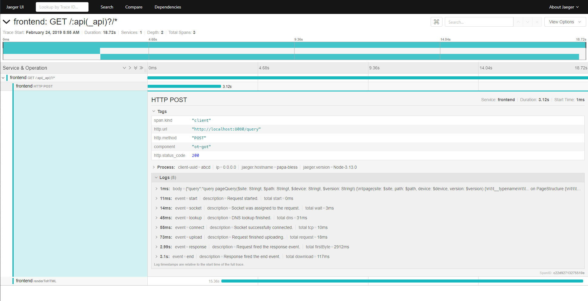

# ot-got [](https://travis-ci.com/Fumler/ot-got) [](https://coveralls.io/github/Fumler/ot-got?branch=master) [](https://packagephobia.now.sh/result?p=ot-got) 

> Convenience wrapper for [`got`](https://github.com/sindresorhus/got) to that adds [opentracing](https://opentracing.io/) spans to the request.

Copied then adapted for [opentracing](https://opentracing.io/) from [gl-got](https://github.com/singapore/gl-got)
Assumes you already use [opentracing-javascript](https://github.com/opentracing/opentracing-javascript) in your project.

## Screenshot
[](https://raw.githubusercontent.com/Fumler/ot-got/master/screenshot.png)

## Install

```
$ npm install --save ot-got
```

or

```
$ yarn add ot-got
```


## Usage
This package can be used like you would use normal [`got`](https://github.com/sindresorhus/got) with the exception of if you want to trace the requests, you must add a config, like so:

```js
const otGot = require('ot-got');

otGot('https://your-microservice.io', {
  tracingOptions: {
    parentSpan: span,
    injectHeaders: true
  }
}).then(res => {
	// response
});
```


## API

Same as [`got`](https://github.com/sindresorhus/got) (including the stream API and aliases), but with some additional options below.

### tracingOptions

Type: `object`

Shared config for all your tracing. See below for possible properties.

#### tracer

Type: [`Tracer`](https://github.com/opentracing/opentracing-javascript/blob/master/src/tracer.ts)<br>
Default: `globalTracer()`

Can be set manually, but if not this will use the [opentracing package `globalTracer()`](https://github.com/opentracing/opentracing-javascript/blob/master/src/global_tracer.ts) function.

#### parentSpan

Type: [`Span`](https://github.com/opentracing/opentracing-javascript/blob/master/src/span.ts)

Passes in a span used as `childOf` ref to the span we create in ot-got for requests.

#### closeParentSpan

Type: `boolean`
Default: `false`<br>

Wether you want the client do close the parent span or not

#### injectHeaders

Type: `boolean`
Default: `false`<br>

Wether you want the client to inject headers to the request or not. By doing this the service you are calling will be able to continue the trace.


## License

MIT
© [Sindre Sorhus](https://sindresorhus.com)
© [Fredrik Pettersen](http://whg.no)
